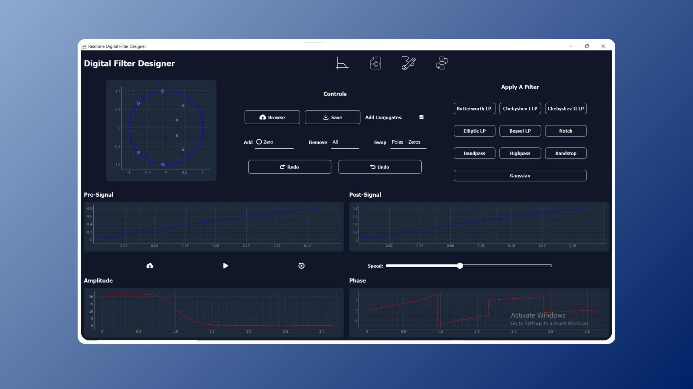
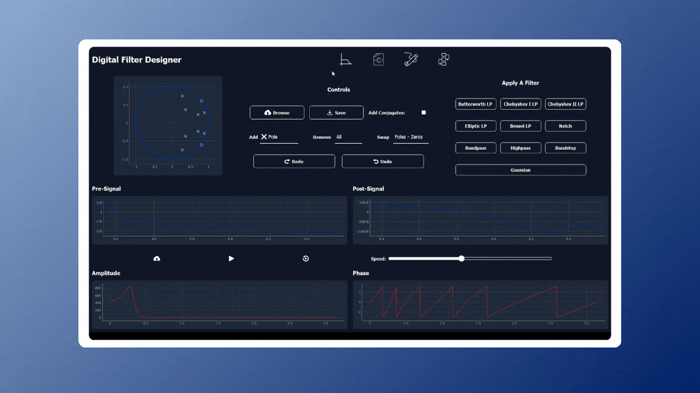
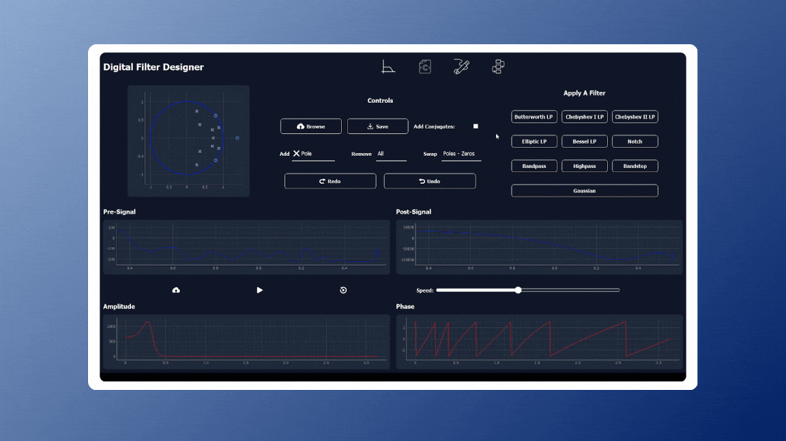

# FilterSymphony: Realtime Digital Filter Designer



The **Realtime Digital Filter Designer** is an interactive desktop application that allows users to design and apply digital filters in real time. By placing and modifying zeros and poles on the z-plane, users can dynamically adjust the filter response and observe its effects on real-time signals.

---

## Features

### 1. Interactive Z-Plane Editor
- **Zero-Pole Placement:**
  - Click to add zeros and poles on the z-plane.
  - Drag elements to modify their positions dynamically.
  - Option to add complex conjugates automatically.
- **Editing Controls:**
  - Delete selected zeros or poles.
  - Clear all zeros, poles, or reset entirely.
  - **Undo and Redo:**
    - Step back or forward through filter design changes.

### 2. Frequency Response Visualization
- **Magnitude and Phase Response Graphs:**
  - Real-time updates based on placed elements.
  - Interactive visualization to analyze filter behavior.

### 3. Real-Time Signal Filtering
- **Apply Designed Filter:**
  - Process signals with at least 10,000 points in real-time.
  - Dynamic display of input and filtered signal progression.
- **Adjustable Filtering Speed:**
  - Control processing speed with a slider (e.g., 1 to 100 points per second).

### 4. Real-Time Signal Input
- **Mouse-Generated Signals:**
  - Generate real-time input signals using mouse movement.
  - Faster motion creates higher frequencies; slower motion generates lower frequencies.

### 5. Phase Correction with All-Pass Filters
- **All-Pass Filter Library:**
  - Select from a predefined set of all-pass filters.
  - Visualize their zero-pole placement and phase response.
- **Custom All-Pass Filter Design:**
  - Define arbitrary coefficients and integrate them into the design.
- **Enable/Disable All-Pass Elements:**
  - Toggle specific all-pass filters via a dropdown menu or checkboxes.

### 6. Filter Realization and Code Generation
- **Filter Realization:**
  - Generate filter coefficients based on the designed zero-pole configuration.
  - Implement different realization structures (e.g., Direct Form I, Direct Form II, Transposed, Lattice).
- **C Code Generation:**
  - Automatically generate C code for embedded system implementation.
  - Export filter coefficients and structures in a hardware-compatible format.

---

## Preview:

### Interactive Z-Plane Editing
- **Real-time Zero-Pole Placement:**
  

### Phase Correction and Allpass filter library
- **Magnitude & Phase Response:**
  

### Real-Time Signal Processing
- **Live Input & Filtering:**
  

### FIlter Realization
- **Filter realization using Direct form 1 , Direct form 2 and Cascade form:**
  
---

## Getting Started

### Setup Instructions

#### Clone the Repository
```bash
git clone https://github.com/yourusername/Digital-Filter-Designer.git
```

#### Navigate to the Project Directory
```bash
cd Digital-Filter-Designer
```

#### Install Required Packages
```bash
pip install -r requirements.txt
```

#### Run the Application
```bash
python main.py
```

### Basic Usage

1. **Design a Filter:**
   - Place zeros and poles on the z-plane.
   - Adjust their positions to modify the filter response.
2. **Analyze the Frequency Response:**
   - Observe magnitude and phase characteristics.
3. **Apply the Filter:**
   - Process a large dataset or generate a real-time signal.
4. **Enable Phase Correction:**
   - Select and apply all-pass filters.

---

## Dependencies

The Realtime Digital Filter Designer relies on the following technologies and libraries:

| **Dependency**       | **Description**                                       |
|-----------------------|-------------------------------------------------------|
| Python 3.x           | Core programming language.                            |
| NumPy                | Numerical computations for signal processing.         |
| SciPy                | Advanced scientific computing and interpolation.      |
| PyQt5                | GUI framework for building desktop applications.      |
| PyQtGraph            | Fast plotting and interactive 2D/3D visualization.    |
| Matplotlib           | Visualization library for plotting response graphs.   |

---

## Contributors <a name="Contributors"></a>
<table>
  <tr>
    <td align="center">
      <a href="https://github.com/karreemm" target="_blank">
        
        <br />
        <sub><b>Kareem Abdel Nabi</b></sub>
      </a>
    </td>
    <td align="center">
      <a href="https://github.com/AhmedXAlDeeb" target="_blank">
        
        <br />
        <sub><b>Ahmed AlDeeb</b></sub>
      </a>
    </td>
    <td align="center">
      <a href="https://github.com/Youssef-Abo-El-Ela" target="_blank">
        
        <br />
        <sub><b>Youssef Abo El-Ela</b></sub>
      </a>
    </td>
    <td align="center">
      <a href="https://github.com/Mostafaali3" target="_blank">
        
        <br />
        <sub><b>Mostafa Ali</b></sub>
      </a>
    </td>
  </tr>
</table>

Thank you for using the Realtime Digital Filter Designer! Feel free to contribute or provide feedback to help us improve.
